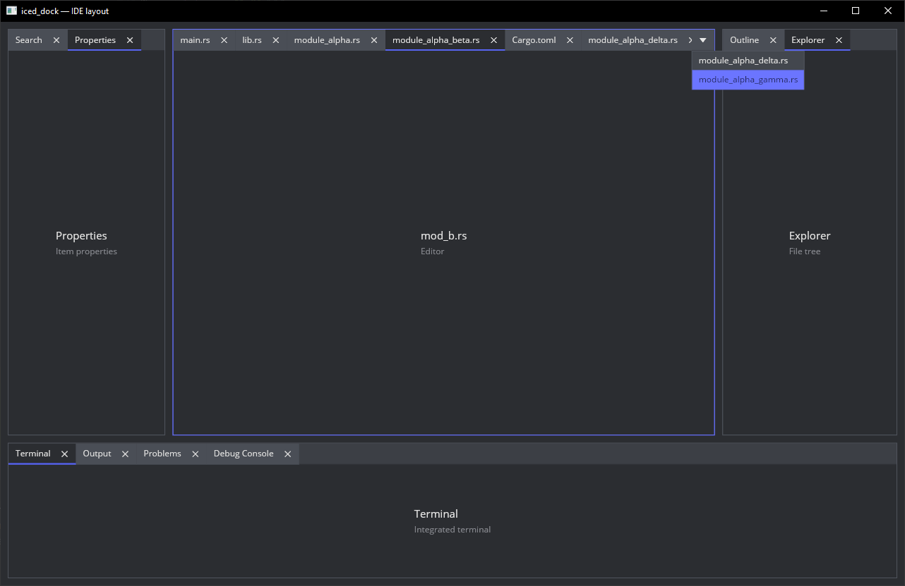

# iced_dock

A docking layout widget for [iced](https://github.com/iced-rs/iced) 0.14. Resizable splits, tabbed panes, drag-and-drop
docking, focus tracking, keyboard navigation, tab groups, tabs overflow handling.



## Example

```toml
[dependencies]
iced_dock = { git = "https://github.com/Fee0/iced_dock.git" }
iced = { version = "0.14", features = ["wgpu"] }
```

```rust
use iced::{Element, Length};
use iced::widget::{container, text};
use iced_dock::{
    dock, horizontal, panel as tab, tabs, DockEvent, DockSession,
    InitialFocus, LayoutTree,
};

#[derive(Debug, Clone, Copy, PartialEq, Eq, Hash)]
enum Panel {
    Explorer,
    Editor,
    Terminal,
}

fn layout() -> LayoutTree<Panel> {
    horizontal([
        tabs([
            tab("explorer", "Explorer", Panel::Explorer),
        ])
            .group("tools"),

        tabs([
            tab("editor", "main.rs", Panel::Editor),
        ])
            .group("documents"),

        tabs([
            tab("terminal", "Terminal", Panel::Terminal),
        ])
            .group("tools"),
    ])
        .weights([0.2, 0.6, 0.2])
}

struct App {
    dock: DockSession<Panel>,
}

impl App {
    fn new() -> Self {
        Self {
            dock: DockSession::from_tree_with_focus(
                layout(),
                InitialFocus::NamedPanel("editor".into()),
            )
                .unwrap(),
        }
    }
}

#[derive(Debug, Clone)]
enum Message {
    Dock(DockEvent),
}

fn update(app: &mut App, message: Message) {
    match message {
        Message::Dock(event) => {
            // Handle dock events here
        }
    }
}

fn view(app: &App) -> Element<'_, Message> {
    container(
        dock()
            .state(app.dock.state())
            .on_event(Message::Dock)
            .content(panel_content)
            .build(),
    )
        .width(Length::Fill)
        .height(Length::Fill)
        .into()
}

fn panel_content(panel: Panel) -> Element<'static, Message> {
    let label = match panel {
        Panel::Explorer => "Explorer",
        Panel::Editor => "Editor",
        Panel::Terminal => "Terminal",
    };

    container(text(label))
        .width(Length::Fill)
        .height(Length::Fill)
        .center(Length::Fill)
        .into()
}
```
