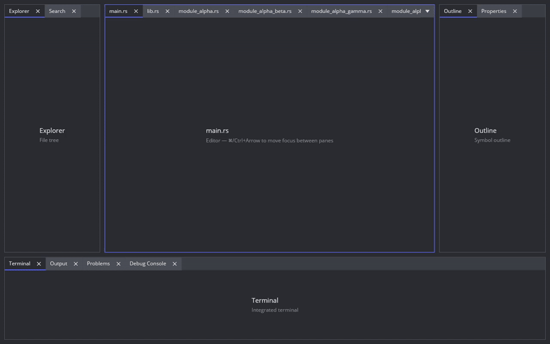

# iced_dock

A docking layout widget for [iced](https://github.com/iced-rs/iced) 0.14. Resizable splits, tabbed panes, drag-and-drop
docking, focus tracking, keyboard navigation, tab groups, tabs overflow handling.



## Example

```toml
[dependencies]
iced_dock = { git = "https://github.com/Fee0/iced_dock.git" }
iced = { version = "0.14", features = ["wgpu", "svg"] }
```

```rust
use iced::widget::{container, text};
use iced::{application, Element, Length, Task};
use iced_dock::{dock, horizontal, panel as tab, tabs, DockEvent, DockSession, LayoutTree};

#[derive(Debug, Clone, Copy, PartialEq, Eq, Hash)]
enum Panel {
    Explorer,
    Editor,
    Terminal,
}

fn layout() -> LayoutTree<Panel> {
    horizontal([
        tabs([tab("explorer", "Explorer", Panel::Explorer)]),
        tabs([tab("editor", "main.rs", Panel::Editor)]),
        tabs([tab("terminal", "Terminal", Panel::Terminal)]),
    ])
    .weights([0.2, 0.6, 0.2])
}

fn main() -> iced::Result {
    application(App::new, update, view).run()
}

struct App {
    dock: DockSession<Panel>,
}

impl App {
    fn new() -> Self {
        Self {
            dock: DockSession::from_tree(layout()).unwrap(),
        }
    }
}

#[derive(Debug, Clone)]
enum Message {
    Dock(DockEvent<Panel>),
}

fn update(_app: &mut App, message: Message) -> Task<Message> {
    match message {
        Message::Dock(_event) => {
            // react to events
        }
    }
    Task::none()
}

fn view(app: &App) -> Element<'_, Message> {
    container(
        dock()
            .state(app.dock.state())
            .on_event(Message::Dock)
            .content(panel)
            .build(),
    )
    .width(Length::Fill)
    .height(Length::Fill)
    .into()
}

fn panel(key: Panel) -> Element<'static, Message> {
    let label = match key {
        Panel::Explorer => "Explorer",
        Panel::Editor => "Editor",
        Panel::Terminal => "Terminal",
    };
    container(text(label))
        .width(Length::Fill)
        .height(Length::Fill)
        .center(Length::Fill)
        .into()
}
```
